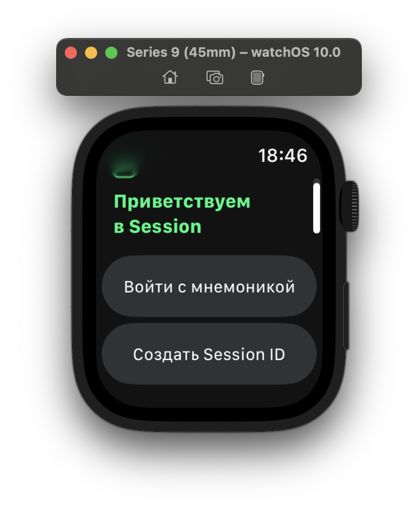
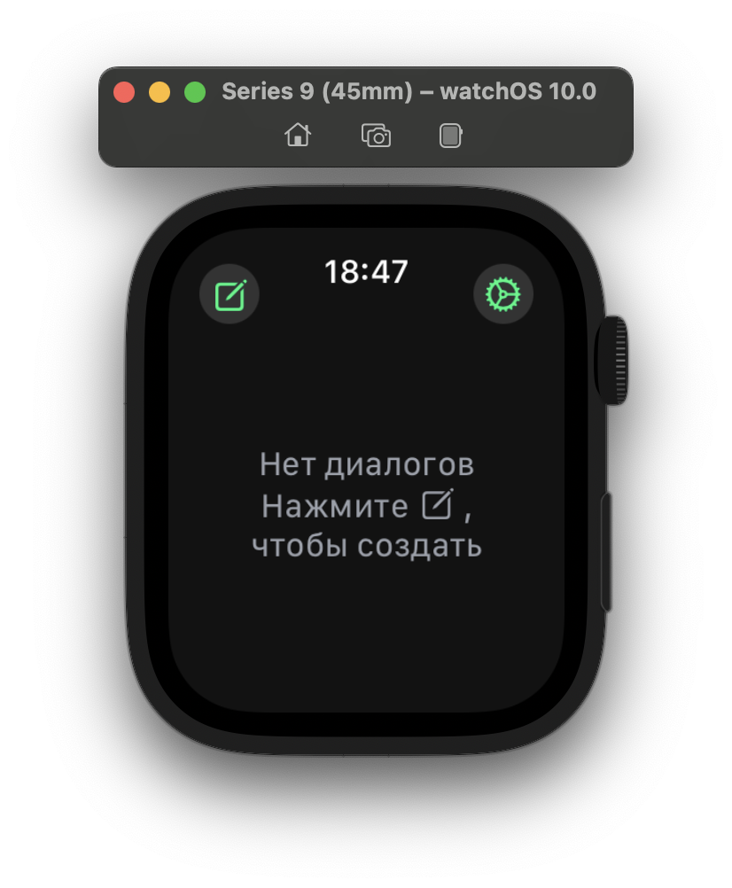
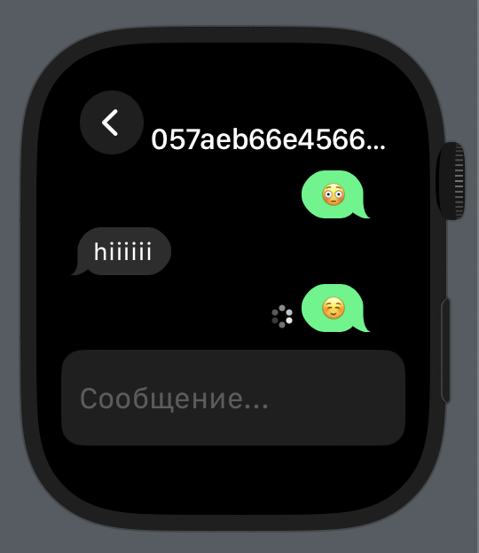
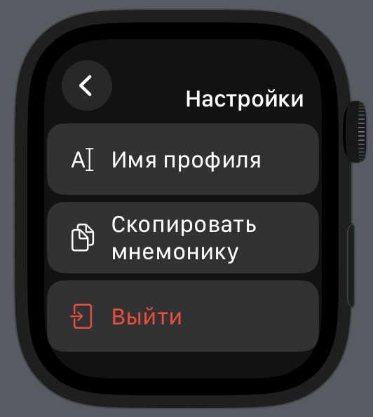

# Session client for WatchOS

Unofficial [Session](https://getsession.org) messenger client for Apple Watch, targeting watch OS 10.

## Supported features

- Send & receive messages
  - [X] Private conversations
  - [ ] Closed groups
  - [ ] Open groups
- [X] ONS resolving
˝
## How does signing in work?

It requires a server with hosted companion website. In simple terms, user is redirected there to input their mnemonic on any device they find comfortable and secure. Mnemonic is encrypted locally and stored on server shortly for watches to sync into its storage. Read in details in website's repository.

Source on GitHub: [https://github.com/VityaSchel/session-watchos-website](https://github.com/VityaSchel/session-watchos-website)

### Why not companion iOS app?

Not everyone has an iPhone ;)

Also I really wanted everything to work completely inside this little silly thing.

## Download from GitHub

[Releases page](https://github.com/VityaSchel/session-watchos/Releases)

## Download from AppStore

[Donate 100$ to me](https://hloth.dev/donate)

## Known Issues

- Sometimes crashes when signing out
  - Tell Apple to fix CoreData: NSBatchDelete won't update UI and deletion of each object individually takes 1 second for each 100 messages. Also sometimes crashes but only if conversations exist, I have no idea why. Simply erase app's data from settings at this point, it will be easier for everyone.

## Credit

Credits to [session-ios](https://github.com/oxen-io/session-ios) developers, most of the code I took from ios client is inside SessionCrypto directory.

Also check out my web Session client: [https://github.com/VityaSchel/session-web](https://github.com/VityaSchel/session-web)